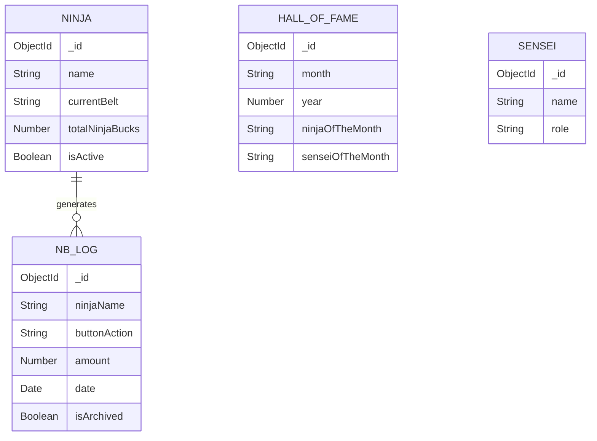

# NinjaDatabase
Website and Database to keep track of Ninjas at Code Ninjas!

## Schemas/Sheets for Database migration

Planning to fully migrate everything to the database website now. 

** all of this is sensei (admin) sided **
| Name of Sheet | Type/Function |
| ---------- | -------- |
| Add Ninja | Adding Ninja/Editing Database |
| Buttons - Already Added | Primarily Adding/Removing Ninjas, Needs a log for whenever a button is pressed, more info given in "NB Log" |
| Ninja Data | Contains details and history  of their ninja bucks activity and general subscription activity. |
| NB Log | Every time a button is pressed in "Buttons", this updates with the date, ninja name, button name and amount of ninja bucks added. Also only contains logs for the current month, all past months go into an archive log |
| Update Progress | This is a bit more sophisticated, it dynamically pulls a ninja from a search, and once it does it fetches what belt they're on and an option to Load, Clear and Update their progress (belt). For information it will display what levels are for a respective belt so senseis know what level to put in correctly. |
| Progress | An overview of each ninja's progress, as in what belts they're on |
| Progress Log | Whenever progress is updated (eg, ninja goes from White -> Yellow belt), it is logged and an option is given to post on discord via a bot, i can give the macro code if needed |
| Old NB Logs | This is the archive log talked about in NB Log, all logs from when archive is pressed goes into here. |
| Inactive | An option to move ninjas that arent coming anymore here, and store their info (amount of ninja bucks, what belt theyre on) on there, for bookkeeping purpose and incase if they come back, we can get them back onto the database. Whoever is in this section will not be displayed on any of the NB or progress stuff. There should be an option to restore their activity. |

idk what process there would be for adding the discord bot functionality

ALSO, something i wanted to do with the archive was include the sensei of the month as well, so one side of the page contains ninja of the month already which is well and good, a smaller other side of the page should contain the sensei of the month for each month as well, AND an option to archive the sensei of the month on the admin side too, similar to each month's ninja of the month. Have to include year in this too, already includes month. **[IN PROGRESS]**

## UML for better visualization

